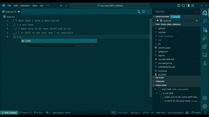

# Tiny-Todo VSCode Extension

A simple extension I built for when I'm building simple stuff where a full featured issue tracker is overkill.

## Current features

- **Based on a simple todo.txt**: Use a simply formatted todo.txt so you can track progress right there in your repository.
- **Integrated View**: Todos are displayed in a dedicated view where you can update and archive them.

## Requirements

This extension doesn't have any specific requirements or dependencies outside of VSCode.

## Future development

As mentioned this extension is made for just myself so any further work will happen when something annoys me too much to keep doing it manually.
